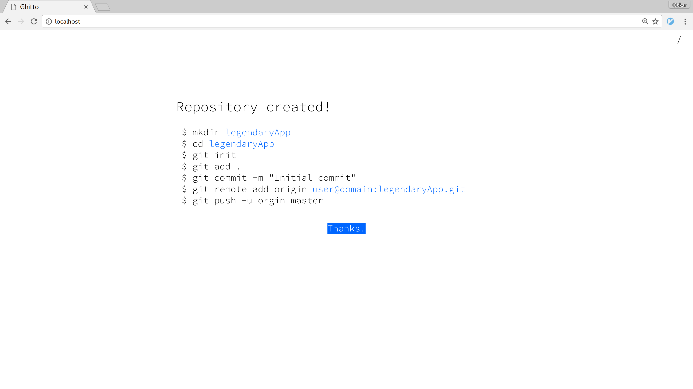
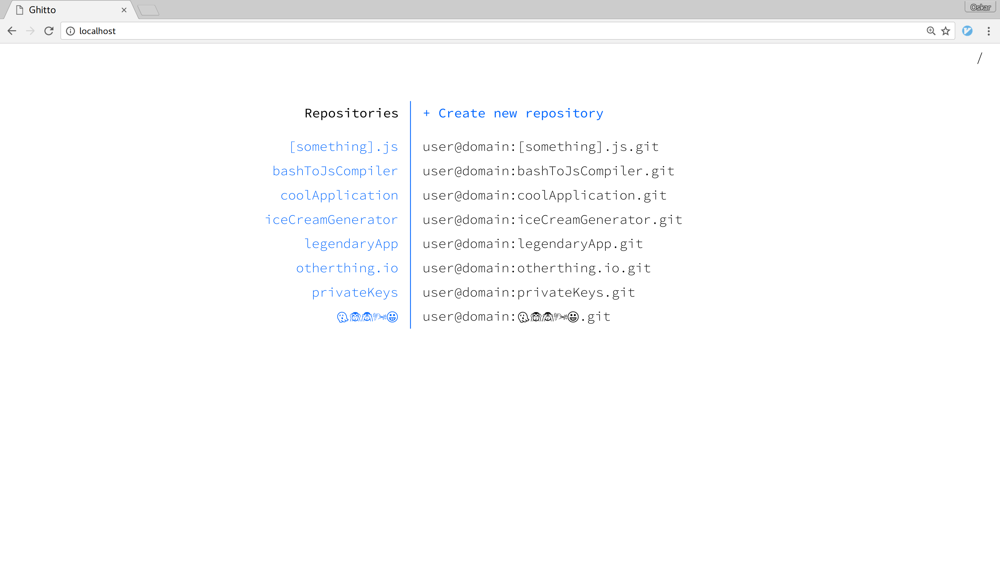
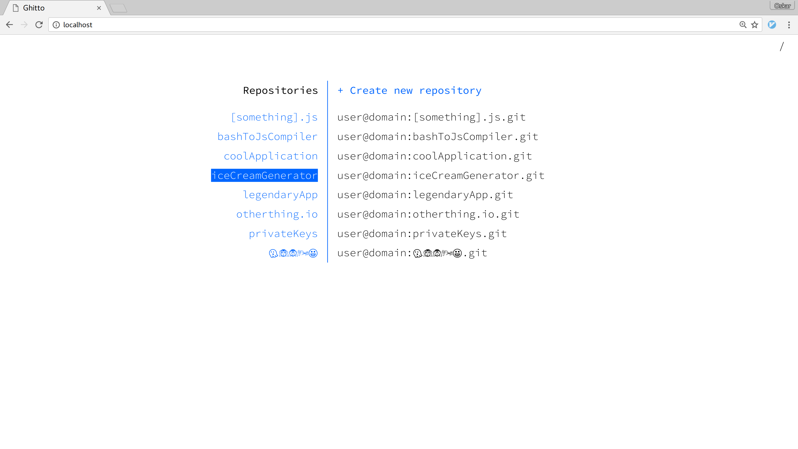
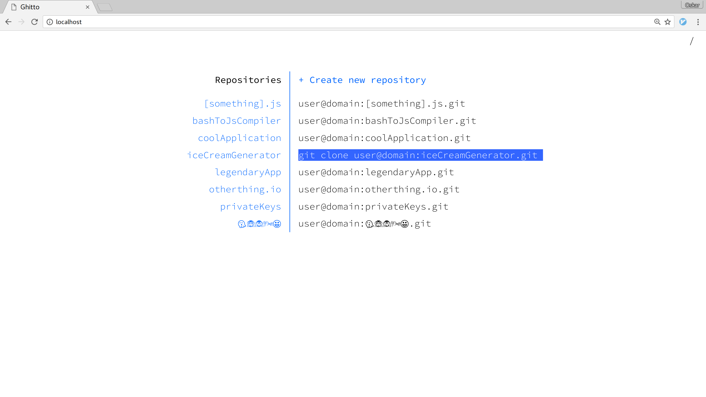

# Ghitto
Ghitto is a minimalistic git repository manager. It allows you to create repositories and helps you with simple tasks such as cloning and initing.

# Install
```sh
npm install -g ghitto
```

# Usage
Start with:
```sh
ghitto <port> <path> <ssh login>
```
where \<port\> represents the port to run the webserver on, \<path\> is the path to the directory containing the git repositories, and \<ssh login\> is the username and domain used to clone.

For example:
```sh
ghitto 80 /var/git user@example.com
```

# Screenshots





